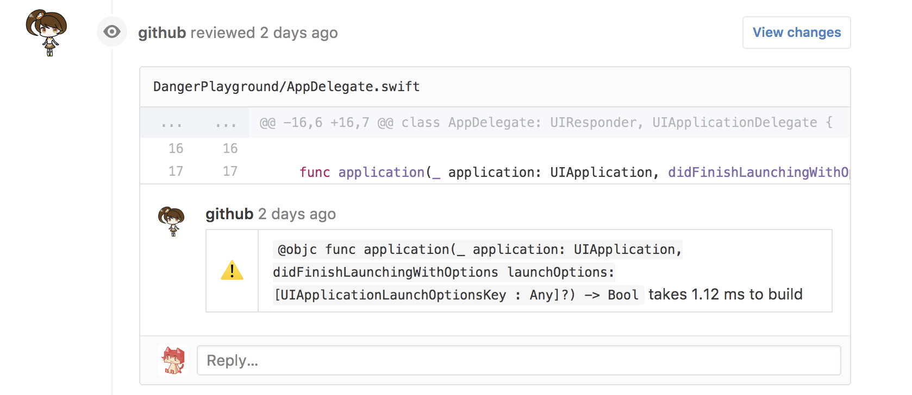

# danger-xcprofiler
[](https://travis-ci.org/giginet/danger-xcprofiler)
[](https://coveralls.io/github/giginet/danger-xcprofiler?branch=master)
[](https://badge.fury.io/rb/danger-xcprofiler)

[danger](https://github.com/danger/danger) plugin for asserting Swift compilation time.

See detail for README of [xcprofiler](https://github.com/giginet/xcprofiler).



## Installation

Add this line to your Gemfile:

```sh
gem 'danger-xcprofiler'
```

## Usage

Just add this line to your Dangerfile:

```ruby
xcprofiler.report 'MyApp'
```

If compilation times of each methods are exceeded the thresholds, `danger` adds inline comment to your PR.

Default thresholds is 50ms for warning, 100ms for failure. 

If you want to change thresholds see the following:

```ruby
# Defines inline_mode
xcprofiler.inline_mode = false
# Defines thresholds (ms)
xcprofiler.thresholds = {
  warn: 100,
  fail: 500
}
xcprofiler.report 'MyApp'
```

## Development

1. Clone this repo
2. Run `bundle install` to setup dependencies.
3. Run `bundle exec rake spec` to run the tests.
4. Use `bundle exec guard` to automatically have tests run as you make changes.
5. Make your changes.
